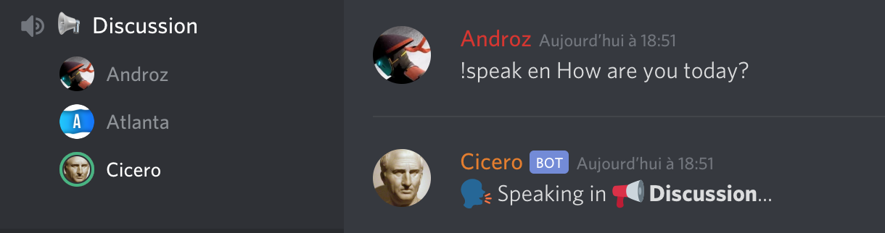
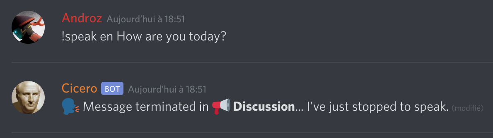
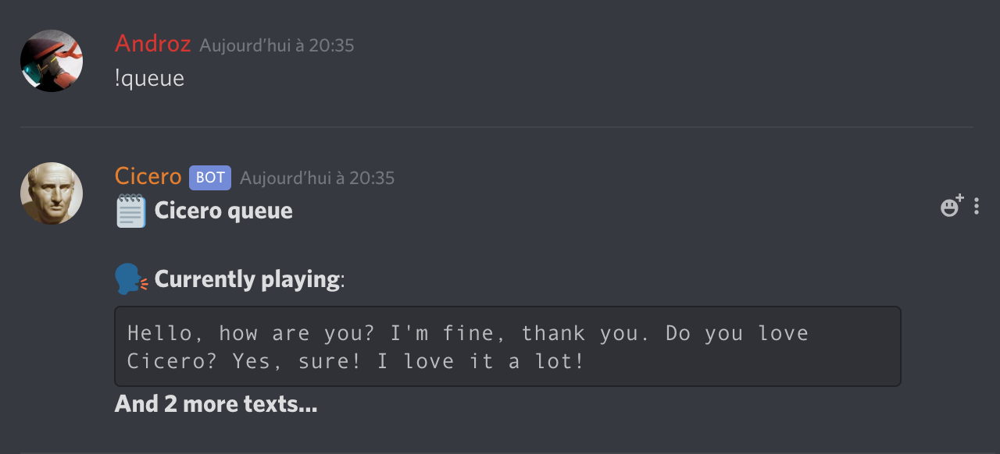

# Cicero - Text-to-speech Discord bot

Cicero is a **text-to-speech** Discord bot, it's able to say anything you can imagine, in the language of your choice!  
Cicero was made with a **Google translate** wrapper, so it's totally **free, no api key is needed!**

## Commands

### Voice commands

`!join`: Joins your voice channel!  
`!speak [language] [text]`: Speaks in your voice channel!

### Commando commands

`!help`: Displays the help page  
`!reload [cmd]`: Reloads a command  
`!load [cmd]`: Loads a command  
`!unload [cmd]`: Unloads a command  
`!disable [cmd/group]`: Disables a command or a group of commands  
`!enable [cmd/group]`: Enables a command or a group of commands  
`!groups`: Lists all command groups  
`!prefix`: Shows or sets the command prefix  
`!ping`: Checks the bot's ping to the Discord server  
`!eval`: Executes JavaScript code  

## Screenshots

